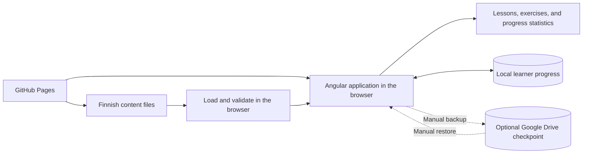
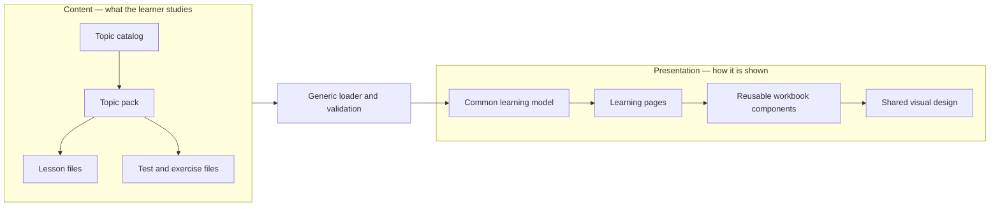
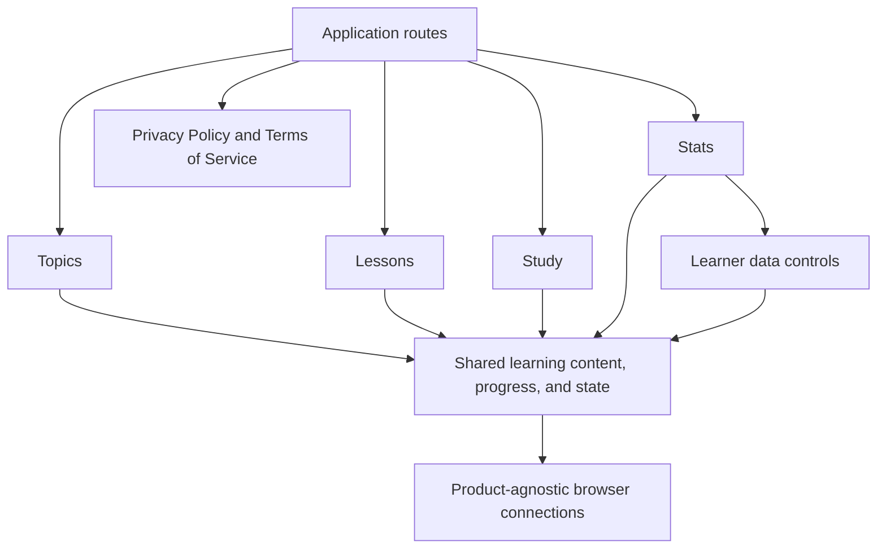
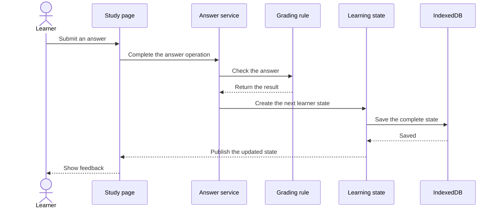
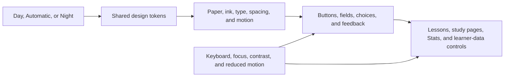

# Sisu Steps

A personal, local-first Finnish exercise notebook built for learning through repeated practice on desktop and mobile.

## Why I am building Sisu Steps

I am developing this app to help me learn Finnish. As I progress in my own studies, I will continue updating the app with new lessons, exercises, explanations, and improvements.

The production version is available here:

**[Open Sisu Steps](https://khosropakmanesh.github.io/sisu-steps/)**

The website also provides a [Privacy Policy](https://khosropakmanesh.github.io/sisu-steps/privacy/) and [Terms of Service](https://khosropakmanesh.github.io/sisu-steps/terms/).

## Why an exercise notebook

I am someone who needs a lot of practice to learn—sometimes more practice than many other people. I wanted a notebook where I could repeat Finnish exercises, understand my mistakes immediately, return to difficult topics, and practise as much as I need without being limited to a small set of examples.

Sisu Steps is therefore designed as an interactive exercise book rather than a conventional course. Each topic pack owns its lessons, tests, and content version, while the app tracks progress, mistakes, reviews, and learning history separately for that pack. Stats derives summaries from that history; there is no separate report record.

## Studying on desktop and mobile

The same learning journey is available at both sizes: choose a topic in **Notebook**, read a lesson or try optional unscored practice, complete a Focused test or mixed Review, revisit mistakes, and check progress in **Stats**. The app keeps the same content, feedback, and progress behavior across desktop and mobile layouts.

On wide screens, Notebook and Stats appear as tabs beside an open folder and workbook. On phones, the folder decoration gives way to a simpler paper layout with a horizontal, touch-friendly navigation row. During a phone study session, the answer and continue actions stay within reach without covering the exercise or feedback. Controls remain usable with a keyboard and with touch.

Progress is stored for the browser profile and site address in use; it does not automatically move between devices. The JSON backup and restore controls let learners preserve or transfer it deliberately.

## Content accuracy and contributing

If you find Sisu Steps useful and want to improve it—or if you notice a mistake—please [open an issue](https://github.com/KhosroPakmanesh/sisu-steps/issues) or [contact me through GitHub](https://github.com/KhosroPakmanesh). Contributions are welcome, and I would be happy to collaborate with people who want to contribute to the project.

I am not a Finnish speaker. I use AI assistance to help create Finnish-learning content, so the lessons and exercises may contain errors. Feedback and corrections from Finnish speakers, teachers, learners, and other contributors are especially valuable.

When reporting a Finnish error, include the topic and lesson or test, the exercise ID or prompt, and what seems wrong. A proposed correction and supporting source are helpful when available.

## Run locally

Use Node.js 22 and npm 11.6.2, the versions used by deployment CI. From the repository root:

```powershell
npm --prefix client ci
npm --prefix client start
```

Open `http://localhost:14200`. To run the aggregate client checks:

```powershell
npm --prefix client run check
```

The [client README](client/README.md) covers browser tests, content validation, and optional local Google Drive configuration.

## Technical architecture

Sisu Steps is a static Angular application that runs in the browser. It does not need an account, backend service, cloud database, or live AI connection. GitHub Pages serves the application and its Finnish content files, while the learner's browser stores progress locally.

### The big picture

The architecture keeps three things separate:

- **Finnish content:** what the learner studies.
- **Presentation:** how lessons and exercises appear and behave.
- **Learner data:** personal progress, answers, mistakes, and learning history.



### Content and presentation are separate

Lessons, tests, exercises, authored answer definitions, and explanations are stored as versioned JSON files under `client/content/`. They are not written inside Angular pages or visual components.

When the app starts, a general-purpose content loader reads the catalog and compact pack manifests. It reads, validates, and builds a complete in-memory learning model for a pack only when that pack is opened, retaining at most two complete packs. The Angular presentation code receives that model and displays it using reusable pages and workbook components.

This means Finnish content can be corrected or expanded without building a new screen for every topic. The visual design can also change without rewriting the learning material.



### Organized around learner journeys

The client uses a feature-slice structure. This is similar to vertical-slice architecture: everything needed for one learner activity is kept together instead of putting every component in one folder and every service in another.

- **Topics:** topic catalog, topic details, and starting points.
- **Lessons:** teaching material, examples, optional practice, and lesson completion.
- **Study:** starting sessions, answering questions, grading, mistakes, and reviews.
- **Stats:** progress overview, topic statistics, test progress, and history-derived summaries.
- **Learner data:** backup, restore, and history clearing.

The separate Legal feature owns the public Privacy Policy and Terms of Service pages. Topics, Lessons, Study, and Stats keep their route pages and workflow code together; Stats composes the Learner data controls. Code used by several learning journeys—including learner-state contracts, IndexedDB persistence, navigation, and derived progress summaries—lives in Learning-shared. Product-agnostic browser infrastructure lives in root shared; the app and design-system areas own the shell and reusable presentation.



All route pages are loaded only when they are needed. The small `app` area is responsible for startup, navigation, the application shell, and connecting features to browser implementations.

### How an answer is processed

Pages do not contain all the grading and storage logic. A page asks a focused service to complete the learner's action. Small, independent rules decide whether the answer is correct and how progress changes. The new complete state is saved before answer feedback and progress are published.



Because grading rules, progress calculations, validation, and state decisions do not depend on Angular or browser APIs, they are easier to test and reason about.

### Browser access stays behind small contracts

Workflow pages and pure rules do not directly open IndexedDB, fetch bundled content, create downloads, or read imported backups. Repositories and browser adapters perform that work, including the optional Google Drive requests. Angular provides those dependencies to the learning workflows.

For example, learning workflows use a learner-state repository without knowing the details of IndexedDB. This keeps browser mechanics replaceable and prevents them from leaking into grading or progress rules.

### UI and design tokens

The interface is designed as a calm Nordic school notebook. Wide screens show a desk, folder, layered paper, tabs, stamps, and other workbook details. On smaller screens, the same content becomes a simpler pocket-notebook layout so decoration does not get in the way of studying.

The visual system uses shared CSS variables called **design tokens**. These tokens are the app's central settings for colors, paper surfaces, fonts, text sizes, spacing, borders, shadows, control sizes, focus indicators, motion, and responsive boundaries. Pages and components reuse these values instead of inventing their own versions, which keeps the complete workbook visually consistent.



Learners can choose **Day**, **Automatic**, or **Night**. Automatic follows the device color scheme, while an explicit choice is remembered separately from learning progress and backups.

Notebook objects are visual cues, not requirements for understanding the app. Actions still use normal links, buttons, inputs, radio choices, and dialogs with visible labels and keyboard support. Correctness, warnings, and other states use text or symbols as well as color. Focus remains visible, touch targets stay practical, forced-color modes are supported, and motion becomes static when the learner prefers reduced motion.

The layout uses container-based responsive rules that also react to enlarged text—not only screen width. Decorative handwriting is limited to optional details; lessons, instructions, and controls use readable print fonts. The UI is built with plain CSS and does not use a third-party component framework.

### Local state and recovery

IndexedDB is the application's only runtime database. It stores learner progress but never stores the authored Finnish content. When the app starts, it loads pack summaries and progress and checks that saved progress still matches the installed content versions. Changing an installed pack clears that pack's incompatible progress. An obsolete state shape or a version entry for a removed pack resets the complete learner state instead of migrating it.

The learner can export and restore a versioned JSON backup or manually keep one optional recovery checkpoint in hidden Google Drive application storage. IndexedDB remains the live authority and no Google request occurs during startup, study, navigation, or browser close. Drive actions request only `drive.appdata`, keep access tokens in memory, and do not read a Google profile.

Before replacing existing progress, file and Drive restore use the same complete parser and validator. New packs start empty, changed packs lose only the incompatible progress named in the confirmation while valid notes survive, and removed packs or unsupported schemas are rejected without changing current progress. The Drive copy is a recovery checkpoint rather than synchronization and has no additional Sisu Steps password encryption.

### Technology and automated checks

- **Client:** Angular 21 standalone components with strict TypeScript.
- **Content:** Versioned JSON topic packs with direct-source validation.
- **State:** Angular signals with complete, atomic IndexedDB saves.
- **Interface:** Plain CSS with repository-owned design tokens and no third-party UI framework. The interface is responsive, keyboard accessible, and supports reduced motion.
- **Deployment:** GitHub Actions builds the production client and deploys the static output to GitHub Pages under `/sisu-steps/`. The workflow checks the browser build, runtime configuration, and direct Privacy Policy and Terms of Service entry points before publishing, and includes a fallback for other direct application routes.
- **Server boundary:** `server/` is reserved for a possible future .NET backend. Sisu Steps has no backend, account system, API, or remote runtime database. Optional manual Drive recovery uses Google authorization and the Drive API; core learning workflows remain independent of them.

Automated checks enforce the architecture as well as code quality. They detect invalid dependencies between learning workflows, circular imports, unreachable files, browser APIs inside pure rule modules, overly broad folders, oversized files, formatting problems, invalid content, and type errors. Unit tests mirror one production owner, integration tests cover stateful cross-workflow operations, and Playwright tests complete learner journeys in the browser.

## Project documentation

- [Product constitution](specs/constitution.md) and [feature specifications](specs/features/README.md) define learner behavior and content policy.
- [Client specifications](client/specs/README.md) describe the current Angular architecture and design system.
- [Content-authoring policy](specs/content-authoring.md) describes how Finnish lessons and exercises are prepared and assessed.

## Finnish grammar reference

- [Uusi kielemme: Finnish grammar overview](https://uusikielemme.fi/finnish-grammar)

Topic-specific sources are recorded in the pack manifests under `client/content/`.

## License

Sisu Steps is a free, noncommercial, source-available project built to welcome contributions. You can use the official app for learning or teaching, study the source, and prepare improvements through a fork, pull request, issue, or an agreed direct-collaboration workflow. The project does not permit commercial use or an independently published version.

Contributors keep copyright in their work and accept a short agreement only once. It gives Sisu Steps the rights needed to merge, improve, and share the contribution as part of the official free project. See the [Sisu Steps Free and Noncommercial Contribution License](LICENSE.md) and friendly [contribution guide](CONTRIBUTING.md).
