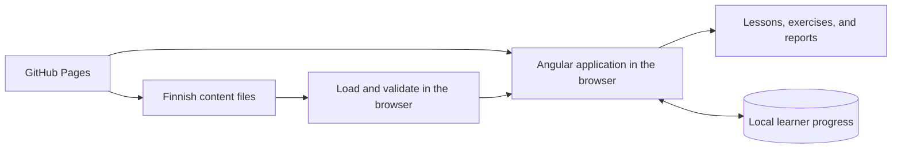
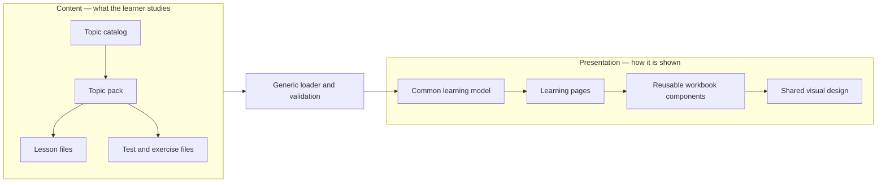
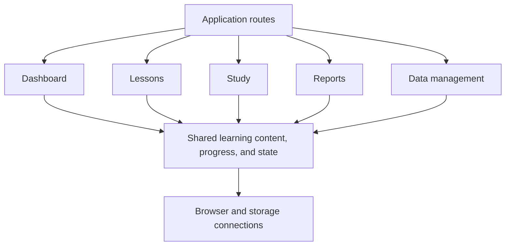
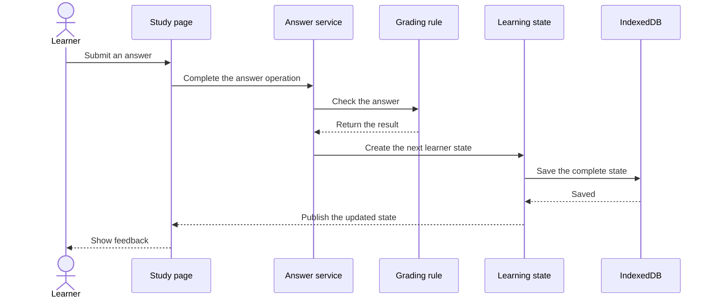
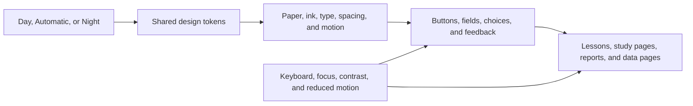

# Sisu Steps

A personal, local-first Finnish exercise notebook built for learning through repeated practice.

## Why I am building Sisu Steps

I am developing this app to help me learn Finnish. As I progress in my own studies, I will continue updating the app with new lessons, exercises, explanations, and improvements.

The production version is available here:

**[Open Sisu Steps](https://khosropakmanesh.github.io/sisu-steps/)**

## Why an exercise notebook

I am someone who needs a lot of practice to learn—sometimes more practice than many other people. I wanted a notebook where I could repeat Finnish exercises, understand my mistakes immediately, return to difficult topics, and practise as much as I need without being limited to a small set of examples.

Sisu Steps is therefore designed as an interactive exercise book rather than a conventional course. Each topic pack owns its lessons, tests, and content version, while the app tracks progress, mistakes, reviews, and reports separately for that pack. The first pack contains 200 Pre-A1–A1.3 grammar-foundation exercises covering vowel harmony, KPT consonant gradation, and the nominative T-plural.

## Content accuracy and contributing

If you find Sisu Steps useful and want to improve it—or if you notice a mistake—please [open an issue](https://github.com/KhosroPakmanesh/sisu-steps/issues) or [contact me through GitHub](https://github.com/KhosroPakmanesh). Contributions are welcome, and I would be happy to collaborate with people who want to contribute to the project.

I am not a Finnish speaker. I currently rely on ChatGPT 5.6 Sol to help generate Finnish-learning content, so the lessons and exercises may contain errors. Feedback and corrections from Finnish speakers, teachers, learners, and other contributors are especially valuable.

## Technical architecture

Sisu Steps is a static Angular application that runs in the browser. It does not need an account, backend service, cloud database, or live AI connection. GitHub Pages serves the application and its Finnish content files, while the learner's browser stores progress locally.

### The big picture

The architecture keeps three things separate:

- **Finnish content:** what the learner studies.
- **Presentation:** how lessons and exercises appear and behave.
- **Learner data:** personal progress, answers, mistakes, and reports.

### Content and presentation are separate

Lessons, tests, exercises, answers, and explanations are stored as versioned JSON files under `client/content/`. They are not written inside Angular pages or visual components.

When the app starts, a general-purpose content loader reads these files, checks that they are valid, and builds an in-memory learning model. The Angular presentation code receives that model and displays it using reusable pages and workbook components.

This means Finnish content can be corrected or expanded without building a new screen for every topic. The visual design can also change without rewriting the learning material.

### Organized around learner journeys

The client uses a feature-slice structure. This is similar to vertical-slice architecture: everything needed for one learner activity is kept together instead of putting every component in one folder and every service in another.

- **Dashboard:** topic catalog, progress overview, and starting points.
- **Lessons:** teaching material, examples, optional practice, and lesson completion.
- **Study:** starting sessions, answering questions, grading, mistakes, and reviews.
- **Reports:** test results and skill-level summaries.
- **Data management:** backup, restore, and progress clearing.

Each slice owns its page, visual files, operations, and rules. Code used by several learning journeys lives in a small Learning-shared area. General browser and storage code lives outside the features so it cannot become mixed with learner behavior.

All route pages are loaded only when they are needed. The small `app` area is responsible for startup, navigation, the application shell, and connecting features to browser implementations.

### How an answer is processed

Pages do not contain all the grading and storage logic. A page asks a focused service to complete the learner's action. Small, independent rules decide whether the answer is correct and how progress changes. The new complete state is saved before the screen is updated.

Because grading rules, report calculations, validation, and state decisions do not depend on Angular or browser APIs, they are easier to test and reason about.

### Browser access stays behind small contracts

Feature code does not directly open IndexedDB, fetch files, create downloads, or read imported backups. It asks a small interface—called a repository or adapter—to perform that work. Angular connects each interface to its browser implementation when the app starts.

For example, learning features use a learner-state repository without knowing the details of IndexedDB. This keeps browser mechanics replaceable and prevents them from leaking into grading or reporting rules.

### UI and design tokens

The interface is designed as a calm Nordic school notebook. Wide screens show a desk, folder, layered paper, tabs, stamps, and other workbook details. On smaller screens, the same content becomes a simpler pocket-notebook layout so decoration does not get in the way of studying.

The visual system uses shared CSS variables called **design tokens**. These tokens are the app's central settings for colors, paper surfaces, fonts, text sizes, spacing, borders, shadows, control sizes, focus indicators, motion, and responsive boundaries. Pages and components reuse these values instead of inventing their own versions, which keeps the complete workbook visually consistent.

Learners can choose **Day**, **Automatic**, or **Night**. Automatic follows the device color scheme, while an explicit choice is remembered separately from learning progress and backups.

Notebook objects are visual cues, not requirements for understanding the app. Actions still use normal links, buttons, inputs, radio choices, and dialogs with visible labels and keyboard support. Correctness, warnings, and other states use text or symbols as well as color. Focus remains visible, touch targets stay practical, forced-color modes are supported, and motion becomes static when the learner prefers reduced motion.

The layout uses container-based responsive rules that also react to enlarged text—not only screen width. Decorative handwriting is limited to optional details; lessons, instructions, and controls use readable print fonts. The UI is built with plain CSS and does not use a third-party component framework.

### Local state and recovery

IndexedDB is the application's only runtime database. It stores learner progress but never stores the authored Finnish content. When the app starts, it loads content and progress and checks that saved progress still matches the installed content versions. For normal versioned data, changing one pack clears only that pack's incompatible progress; references to removed content are also cleaned up.

The learner can export and restore a versioned JSON backup. Before replacing existing progress, the app checks the backup format and export time, content versions, correction and note records, and references to installed topics, tests, exercises, and lessons.

### Technology and automated checks

- **Client:** Angular 21 standalone components with strict TypeScript.
- **Content:** Versioned JSON topic packs with direct-source validation.
- **State:** Angular signals with complete, atomic IndexedDB saves.
- **Interface:** Plain CSS with repository-owned design tokens and no third-party UI framework. The interface is responsive, keyboard accessible, and supports reduced motion.
- **Deployment:** GitHub Actions builds the production client and deploys the static output to GitHub Pages under `/sisu-steps/`.
- **Server boundary:** `server/` is reserved for a possible future .NET backend. No backend, authentication, API, or remote database is currently implemented, and core learning workflows are designed to remain independent of one.

Automated checks enforce the architecture as well as code quality. They detect invalid dependencies between features, circular imports, unreachable files, browser APIs inside pure rule modules, overly broad folders, oversized files, formatting problems, invalid content, and type errors. Unit tests mirror the production feature structure, while Playwright tests complete learner journeys in the browser.

## Grammar references

- [Uusi kielemme: Vowel Harmony](https://uusikielemme.fi/finnish-grammar/vowel-harmony-vokaaliharmonia-finnish-grammar)
- [Uusi kielemme: The T-Plural](https://uusikielemme.fi/finnish-grammar/finnish-cases/grammatical-cases/the-t-plural-t-monikko-plural-nominative)
- [Uusi kielemme: Beginner Finnish Topics A1](https://uusikielemme.fi/language-levels/beginner-finnish-topics-level-a1-a1-1-to-a1-3)

## License

Sisu Steps is a free, noncommercial, source-available project built to welcome contributions. You can use the official app for learning or teaching, study the source, and prepare improvements through a fork, pull request, issue, or an agreed direct-collaboration workflow. The project does not permit commercial use or an independently published version.

Contributors keep copyright in their work and accept a short agreement only once. It gives Sisu Steps the rights needed to merge, improve, and share the contribution as part of the official free project. See the [Sisu Steps Free and Noncommercial Contribution License](LICENSE.md) and friendly [contribution guide](CONTRIBUTING.md).
